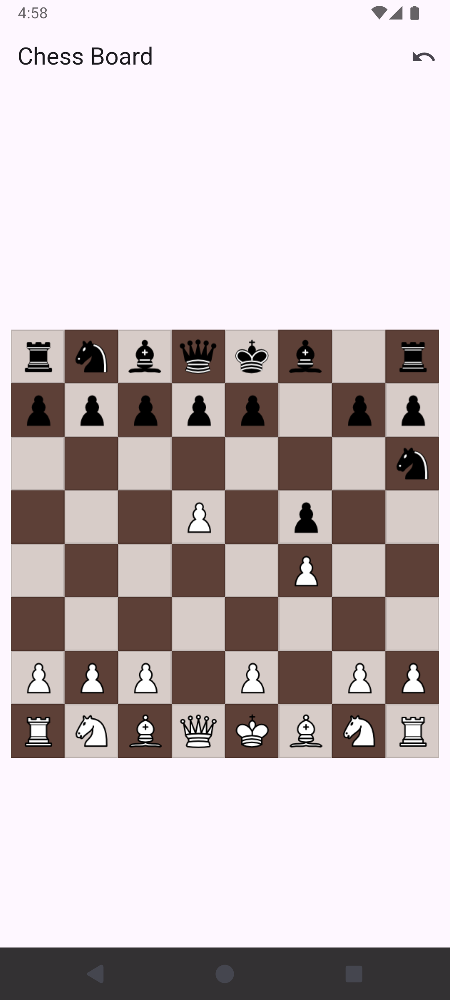

# S Games

## Chess Game App

A Flutter-based chess game application with an interactive board and comprehensive move tracking system.

### Screenshot

<div align="center">
  
</div>
<p align="center"><i>Main game interface showing the chess board and pieces</i></p>

### Installation

1. Clone the repository:

```bash
git clone https://github.com/Subhendu-Kumar/sgames.git chess-game-app
cd chess-game-app
```

2. Install dependencies:

```bash
flutter pub get
```

3. Ensure you have the chess piece images in the correct directory:

```
assets/
  images/
    wK.png  # White King
    wQ.png  # White Queen
    wR.png  # White Rook
    wB.png  # White Bishop
    wN.png  # White Knight
    wP.png  # White Pawn
    bK.png  # Black King
    bQ.png  # Black Queen
    bR.png  # Black Rook
    bB.png  # Black Bishop
    bN.png  # Black Knight
    bP.png  # Black Pawn
```

4. Update your `pubspec.yaml` file to include the assets:

```yaml
flutter:
  assets:
    - assets/images/
```

5. Run the app:

```bash
flutter run
```
