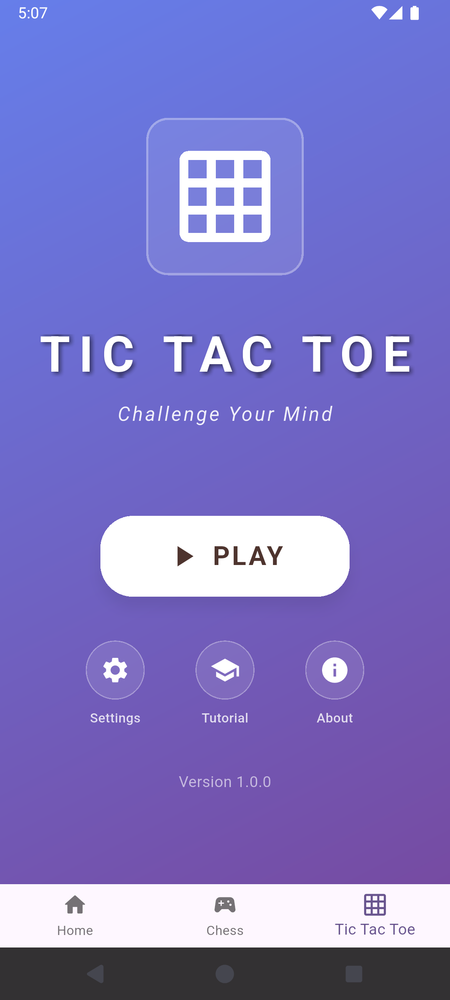

# S Games

A collection of classic Flutter-based game applications featuring interactive gameplay and modern UI design.

<div align="center">
  
</div>
<p align="center"><i>Home screen and game interface</i></p>

## Games Included

### Chess Game App

A Flutter-based chess game application with an interactive board and comprehensive move tracking system.

#### Screenshot

<div align="center">
  
  
  
  
  
</div>
<p align="center"><i>Home screen and game interface</i></p>

### Tic Tac Toe Game App

A classic Flutter tic-tac-toe game with clean design and intuitive gameplay mechanics.

#### Screenshots

<div align="center">
  
  
  
  
</div>
<p align="center"><i>Home screen and game interface</i></p>

## Installation

1. Clone the repository:

```bash
git clone https://github.com/Subhendu-Kumar/sgames.git
cd sgames
```

2. Install dependencies:

```bash
flutter pub get
```

3. Ensure you have the required assets in the correct directories:

### Chess Assets

```
assets/
  images/
    wK.png  # White King
    wQ.png  # White Queen
    wR.png  # White Rook
    wB.png  # White Bishop
    wN.png  # White Knight
    wP.png  # White Pawn
    bK.png  # Black King
    bQ.png  # Black Queen
    bR.png  # Black Rook
    bB.png  # Black Bishop
    bN.png  # Black Knight
    bP.png  # Black Pawn
```

### Tic Tac Toe Assets

```
assets/
  images/
    x_icon.png  # X mark (optional)
    o_icon.png  # O mark (optional)
```

4. Update your `pubspec.yaml` file to include the assets:

```yaml
flutter:
  assets:
    - assets/images/
```

5. Run the app:

```bash
flutter run
```

## Features

### Chess Game

- Interactive chess board with piece movement
- Move validation and legal move highlighting
- Undo functionality
- Turn-based gameplay
- Checkmate detection

### Tic Tac Toe Game

- Clean 3x3 game grid
- Two-player gameplay (X vs O)
- Win detection (horizontal, vertical, diagonal)
- Game reset functionality
- Score tracking
- Modern gradient UI design

## Requirements

- Flutter SDK 3.0+
- Dart 3.0+
- Android Studio / VS Code
- Android/iOS device or emulator

## Project Structure

```
sgames/
├── lib/
│   ├── chess/
│   │   ├── data/
│   │   ├── engine/
│   │   └── presentation/
│   ├── tic_tac_toe/
│   │   ├── data/
│   │   ├── engine/
│   │   └── presentation/
│   ├── core/
│   │   ├── utils/
│   │   ├── view/
│   │   └── widgets/
│   ├── s_games.dart
│   └── main.dart
├── assets/
│   ├── images/
│   └── screenshots/
└── pubspec.yaml
```

## Contributing

1. Fork the repository
2. Create a feature branch
3. Make your changes
4. Add tests if applicable
5. Submit a pull request

## License

This project is licensed under the MIT License - see the LICENSE file for details.
